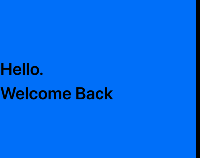
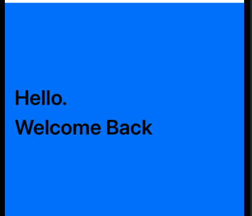
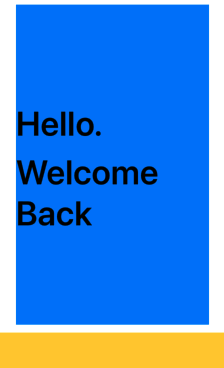
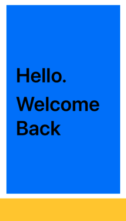
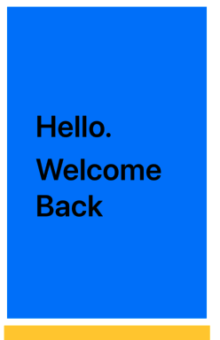

# Twitter-SwiftUI

# I. ContentSize, Frame và Space

Về cơ bản thì `Frame = ContentSize + Space`. Từ `Frame`, ta có các loại xét `frame` thường sử dụng là `xét cứng with hoặc height` hoặc xét `maxWidth or minWidth`. Khi xét loại nào của frame thì cũng sẽ ảnh hưởng tới `contentSize` và `Space` của View đó.

- `maxWidth`:

```swift
VStack(alignment: .leading, spacing: 8) {
    HStack { Spacer() }
    
    Text("Hello.")
        .font(.largeTitle).fontWeight(.semibold)
    
    Text("Welcome Back")
        .font(.largeTitle).fontWeight(.semibold)
}
.frame(maxWidth: .infinity)
.frame(height: 320)
.background(.blue)
```



Ta thấy ở đây chưa xét `padding` hay gì cả, giờ ta sẽ tiến hành xét `padding`.

```swift
    .frame(maxWidth: self.withScreen)
    .frame(height: 320)
    .padding()
    .background(.blue)
```

Output:



Ta thấy rằng phần `Text Hello` được nén lại vào bên trong, điều đó là bởi vì ta xét `maxWidth`, xet `maxWidth = .infinity hay widthScreen` thì cơ bản đều như nhau. Lúc này khi xét `padding`, thì `frame` sẽ chỉ có thể được phình to nhất đến giá trị `maxWidth`, khi đến giá trị `maxWidth` rồi, thì nó sẽ tiến hành co `contentView` cho đến khi phù hợp với giá trị `padding` ta xét. Nào hãy nhìn thử khi xét cứng `with`:

```swift
    .frame(width: self.withScreen)
    .frame(height: 320)
    .padding()
    .background(.blue)
```

Output:


Bạn thấy ko, khi xét `padding` cũng ko thay đổi gì, lý do là gì ? Đó là khi ta xét `width = self.widthScreen`, đó là fix cứng width, nên sau đó xét `padding`, thì `frame width` được to ra theo các cạnh và trào ra ngoài, chứ ko nén lại như ví dụ trên. Bên trên là `max` rồi, nên nó to ra như thế, khi ko to được nữa thì nó sẽ nén lại cho phù hợp với `padding`.

- Ta cũng chú ý thêm, khi khởi tạo 1 View, thì nó chưa có `padding`, tương tự với `padding = 0`.

# II. Order of modifier

Giờ ta có ví dụ như này:

```swift
VStack(alignment: .leading, spacing: 8) {
    HStack { Spacer() }
    
    Text("Hello.")
        .font(.largeTitle).fontWeight(.semibold)
    
    Text("Welcome Back")
        .font(.largeTitle).fontWeight(.semibold)
}
.frame(width: self.withScreen - 200)
.frame(height: 320)
.background(.blue)
```

Sau đó ta tiến hành chèn `padding()` lên trước `frame(width: )` như sau:

```swift
    .padding()
    .frame(width: self.withScreen - 200)
    .frame(height: 320)
    .background(.blue)
```

Sau đó chèn `padding()` vào sau `frame(width: )` như sau:

```swift
    .padding()
    .frame(width: self.withScreen - 200)
    .frame(height: 320)
    .padding()
    .background(.blue)
```

| Before Add Padding First | After Add Padding before Xét frame | Add Padding After xét frame 
| :--------: | :--------: | :--------: | 
|   |  |  |

Đầu tiên chưa có `padding` và có width cứng là `self.withScreen - 200`, sau đó ta xét `padding` trước xét frame, điều đó có nghĩa là nó sẽ có `frame với with là self.withScreen - 200` và với `padding là default = 16` nên nó sẽ cách rìa 1 khoảng như kia, và content bị bó trong. Cuối cùng ta lại xét `padding` tiếp, điều đó có nghĩa là nó sẽ mở rộng ra nữa theo các phía(kiểu `frame_sau = frame_trước + padding`). CŨng có nghĩa là càng viết thêm `padding` đằng sau thì frame sẽ càng mở rộng ra nữa. 